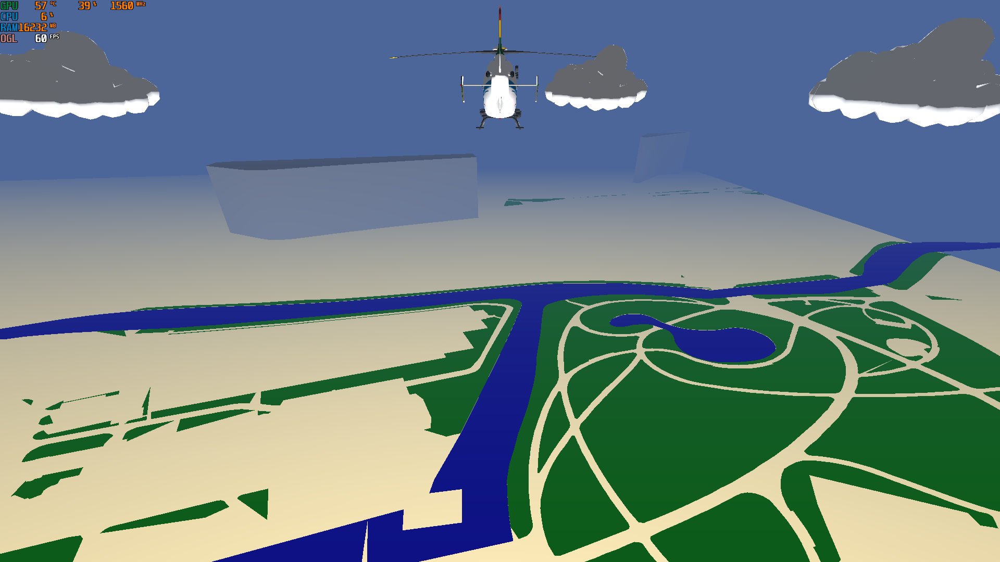
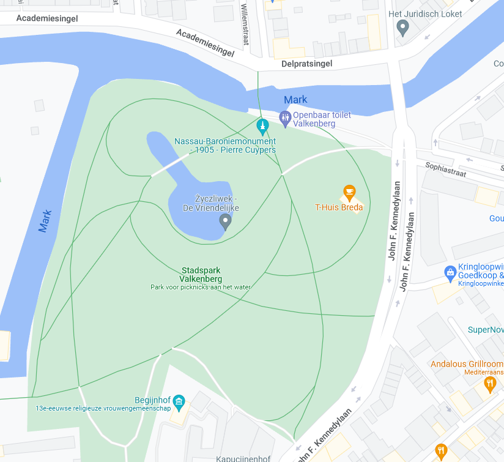
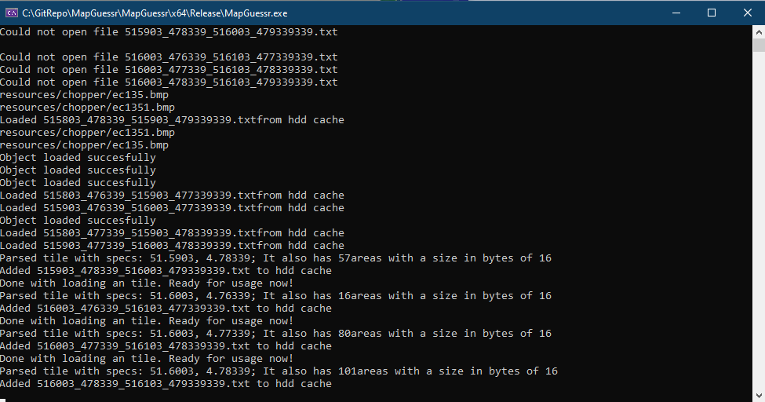

# MapGuessr
This is an application that takes data from the Overpass API and converts it to an 3D-world. It does this by first collecting polygons from the water, residential and grass. After this it converts these in to triangles. And colors them accordingly and ads height to residential. 

The result is this. The first image contains the 3D-generated world. The second image contains a screenshot from google maps of the real map. 
As you can see it fully generates the world accordingly.

Though there is a lot of work to in improving it. For example there is still the need to textures to the ground an parse more types of polygons. The polygon parser library that I used also needs improvment because of glitches with parsing non-convex polygons. So it is till in progress.

The application parses the data from the API as is earlier stated but also caches this data. First it caches it in RAM in runtime. But it also caches the downloaded tiles on the SSD or HDD depending on the location of the program.

You can see this in the image below. 

